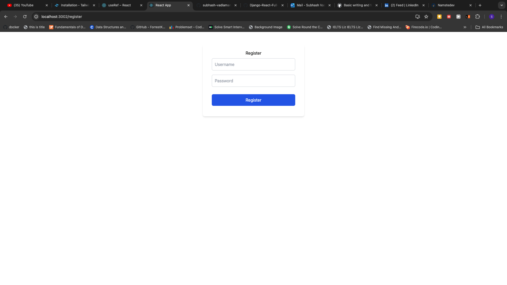
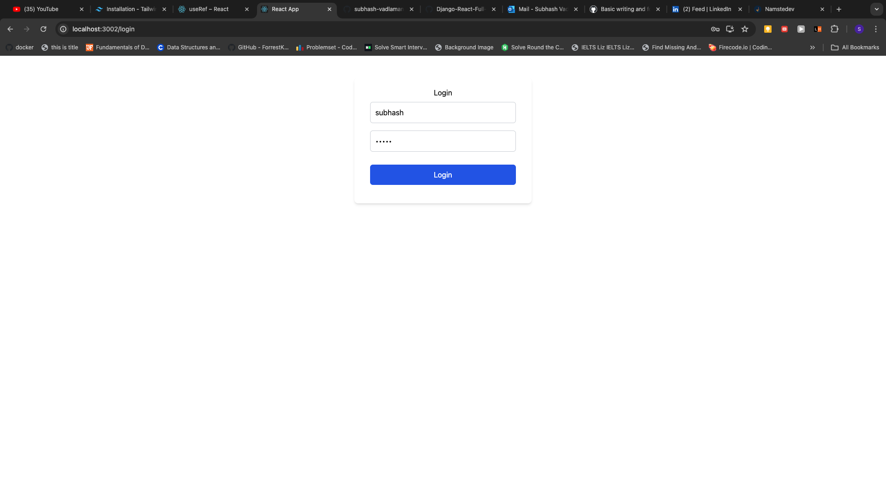
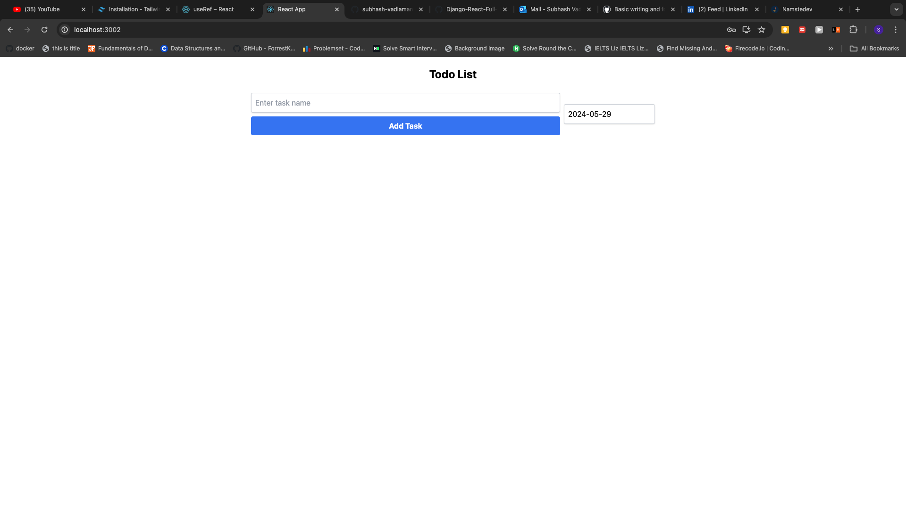
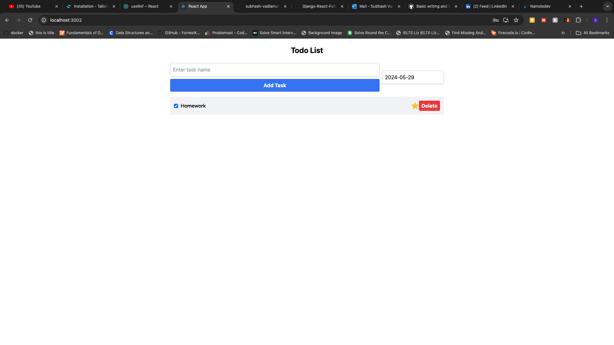

# Task Calendar Pro

## Description

This Todo application offers a sophisticated platform for managing daily tasks with an intuitive calendar-based interface. Designed to enhance productivity, the software supports user registration and secure login functionality, ensuring that each user's task list is private and protected.

Key Features:
User Registration and Authentication: Users can register with a username and password. The application uses JWT tokens for authentication, ensuring secure access and preventing unauthorized use.

Efficient Task Management: Once logged in, users are presented with a clean and simple user interface. The main feature of the application is the task input section located in the center of the page, where users can quickly enter task titles and details.

Calendar Integration: Each task is associated with a specific calendar date, allowing users to organize their tasks more visually and efficiently. Tasks can be added to any date, making it easy to plan days, weeks, or even months in advance.

Real-Time Updates: Upon submitting a task, users receive immediate visual confirmation through an alert, and the new task appears in the list of tasks. Each task displays its creation date and includes a "Delete" button, allowing for easy management and prioritization of daily objectives.

Interactive Task List: The list of tasks is dynamically updated. Tasks can be marked as completed or highlighted as important ("starred"), providing users with a flexible way to track their progress. Users can also delete tasks as needed, with each deletion confirmed via an alert to prevent accidental removal.

User Experience:
The application's user interface is designed for clarity and ease of use. The task management area is strategically positioned in the center of the screen with the task list accessible at a glance. This design ensures that users can focus on their tasks without distractions.

Security:
Security is a priority, with JWT authentication safeguarding access and ensuring that tasks are only visible to the appropriate user. The registration and login processes are streamlined for user convenience while maintaining high security standards to prevent unauthorized access.

Logging out is done by adding `/logout` to the URL, enhancing user privacy by preventing access to content without logging in.

- _Register a User_: 
- _Login a User_: 

## Installation

1. Clone the project from the GitHub repository.
   ```bash
   git clone git@github.com:subhash-vadlamani/TaskCalendarPro.git
   ```
2. Create a virtual environment and install required libraries.
   ```bash
   python -m venv venv
   source venv/bin/activate  # On Windows use `venv\Scriptsctivate`
   pip install -r requirements.txt
   ```
3. Run migrations to set up the database.
   ```bash
   python manage.py makemigrations
   python manage.py migrate
   ```
4. Start the Django backend server.
   ```bash
   python manage.py runserver
   ```
5. Ensure npm is installed and start the frontend application. Run the below commands by going to frontend/todo-react. Make sure that package.json file exists
   ```bash
   npm install
   npm run dev
   ```

## Usage

- **Login/Register**: Navigate to the login and register pages to access your account.
- **Create Tasks**: Enter the task name and the date for which you want to create the task and submit.
- **Delete Notes**: Click the "Delete" button next to any task to remove it.
- **Mark Tasks**: Click on the checkbox to mark the task as completed.
- **Start Tasks**: Click on the start icon to mark the tasks as important.

**Screenshots**

- \_Creating a Task: 
- Completing a Task and highlighting it: 

## Contributing

To contribute to this project, clone the repository and send a pull request.

## Contact Information

- Email: vadlamanisubhash1998@gmail.com
